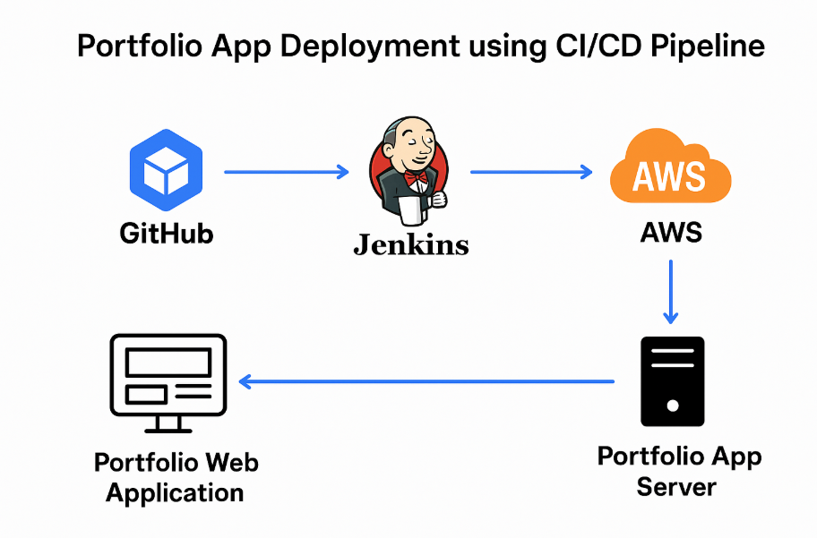

# portfolio-app-deployment-CICD

## Project Overview

This project demonstrates how to deploy a personal portfolio web application using a Jenkins CI/CD pipeline on AWS EC2 instances.
It automates the build, test, and deployment process to ensure faster and reliable delivery of updates.

## Project Architecture

## Services Used:

AWS EC2 – Hosting Jenkins and Application servers

Jenkins – CI/CD automation

GitHub – Source code management

python / HTML / Portfolio App – Application code

📁 Folder Structure

portfolio-app-deployment-CICD/
│
├── Jenkinsfile

├── app.js                     # Portfolio source files

├── package.json                # For Node.js-based portfolio

├── README.md

## Steps to Setup

 ### Step 1: Launch EC2 Instances

Launch 2 EC2 instances:

Jenkins Server

Portfolio App Server

## Step 2: Connect GitHub Repository

Push your portfolio code to GitHub:

git add .

git commit -m "Initial commit"

git remote add origin https://github.com/Sharayu1707/portfolio-app-deployment-CICD.git

git push -u origin main

### Step 3: Create Jenkins Pipeline

In Jenkins Dashboard → New Item → Pipeline

Connect GitHub repo

Add pipeline script using Jenkinsfile

### Step 4: Access the Portfolio

Open in browser:

http://<protfolio_SERVER_PUBLIC_IP>:5000

## Advantages

✅ Continuous Integration & Delivery

✅ Automated Deployment

✅ Easy Rollback and Version Control

✅ Scalable and Reliable Architecture

## Disadvantages

 Requires initial AWS setup and cost
 
 Jenkins configuration can be complex for beginners

## Conclusion

This project demonstrates how to automate the deployment process of a Portfolio Web Application using a CI/CD pipeline with Jenkins and AWS.
By integrating GitHub, Jenkins, and EC2, the process of building, testing, and deploying becomes seamless and efficient.
